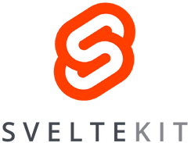

# Technologies

This document describes the technologies used for this project.

Click on any of the headers below to learn more about the mentioned topic.

## Table of Contents

- [**Svelte**](#svelte) - Frontend framework

  - [**TypeScript**](#typescript) - Scripting language (JavaScript with types)
  - [**Skeleton UI**](#skeleton-ui) - UI framework
  - [**Tailwind CSS**](#tailwind-css) - CSS framework

- **ASP.NET Core**

  - [**C#**](#csharp) - Programming language
  - [**Swagger**](#swagger) - API documentation
  - [**Entity Framework Core**](#entity-framework-core)

  

 

## [What is SvelteKit?](https://svelte.dev/)

SvelteKit is built on Svelte, a UI framework that uses a compiler to let you write breathtakingly concise components that do minimal work in the browser, using languages you already know — HTML, CSS and JavaScript.

It was selected for the following reasons:

- Cloudflare Pages supports it
- It is a modern, lightweight, and fast frontend framework
- I am very familiar with it and can therefore work quickly
- It is easy to understand and use and has great documentation for beginners

## [TypeScript](https://www.typescriptlang.org/)

Typescript is a superset of JavaScript that adds types to the language.

I use this because it makes the code easier to understand and maintain.

## [Skeleton UI](https://www.skeleton.dev/)

Skeleton UI is a UI framework that allows you to quickly build beautiful, responsive, and accessible websites on top of SvelteKit, allowing configuration with the help of Tailwind CSS.

## [Tailwind CSS](https://tailwindcss.com/)

Tailwind CSS is a CSS framework that allows you to quickly build beautiful, responsive, and accessible websites.

I chose this because Skeleton UI uses it, and it is fast and easy to use.

  

 

## [What is ASP.NET Core?](https://docs.microsoft.com/en-us/aspnet/core/introduction-to-aspnet-core)

ASP.NET Core is a backend framework that allows you to write web-apps using C#.

It was selected for the following reasons:

- It is a modern, lightweight, modular, easily testable, and fast backend framework
- I have used it extensively in the past and am therefore very familiar with it
- It is easy to understand and use and has great documentation for beginners
- C# has endless libraries and packages that can be used to extend the functionality of the backend
- It supports deploying directly from GitHub repositories to Azure App Service using GitHub Actions
- Swagger documentation is automatically generated by it by default

## [C#](https://learn.microsoft.com/en-us/dotnet/csharp/)

C# is a well established, modern, and fast programming language that can be used to write most types of applications nowadays.

## [Swagger](https://swagger.io/)

Swagger is a API specification tool that allows you to document your API's with ease.

ASP.NET Core supports Swagger out of the box, and it is therefore easy to set up and use.

## [Entity Framework Core](https://docs.microsoft.com/en-us/ef/core/)

Entity Framework Core is an ORM (Object Relational Mapper) that allows you to easily interact with databases using C#.
